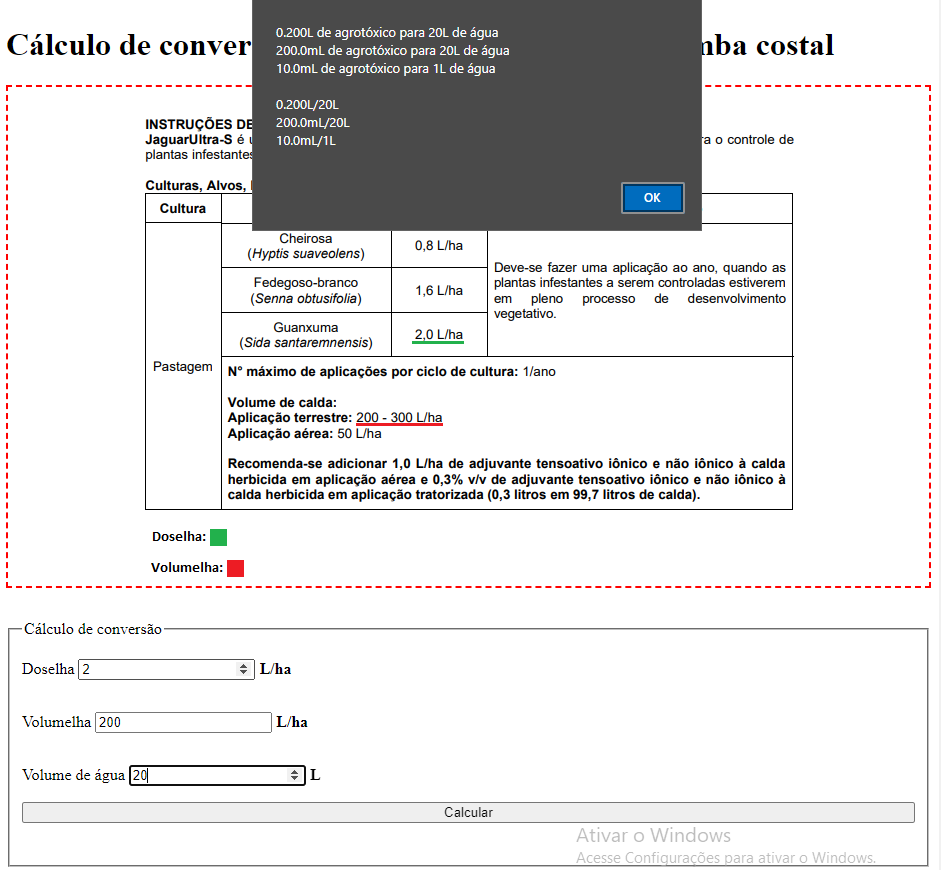

# Cálculo de conversão de agrotóxico L/ha para mL/L

Dosagens testadas que apresentaram bons resultados:

- 10mL/L agrotóxico **disparo ultra-s**:

  - [x] Pulverizador costal manual "D20" jacto - 20L, bico 02
  - [x] Pulverizador costal manual PJH20 jacto - 20L, bico 02
  - [x] Pulverizador costal motorizada SR 420 - 13L, regulagem do bico 3 de 6

&nbsp;

- 10mL/L agrotóxico **jaguar ultra-s**:

  - [x] Pulverizador costal manual "D20" jacto - 20L, bico 02
  - [x] Pulverizador costal manual PJH20 jacto - 20L, bico 02
  - [x] Pulverizador costal motorizada SR 420 - 13L, regulagem do bico 3 de 6

&nbsp;

- 10mL/L agrotóxico **garlon 480 br**:

  - [ ] Pulverizador costal manual "D20" jacto - 20L, bico 02
  - [ ] Pulverizador costal manual PJH20 jacto - 20L, bico 02
  - [ ] Pulverizador costal motorizada SR 420 - 13L, regulagem do bico 3 de 6

&nbsp;

- 15mL/L agrotóxico **tractor**:

  - [ ] Pulverizador costal manual "D20" jacto - 20L, bico 02
  - [ ] Pulverizador costal manual PJH20 jacto - 20L, bico 02
  - [ ] Pulverizador costal motorizada SR 420 - 13L, regulagem do bico 3 de 6
